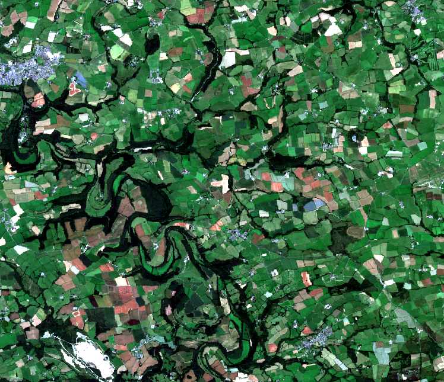
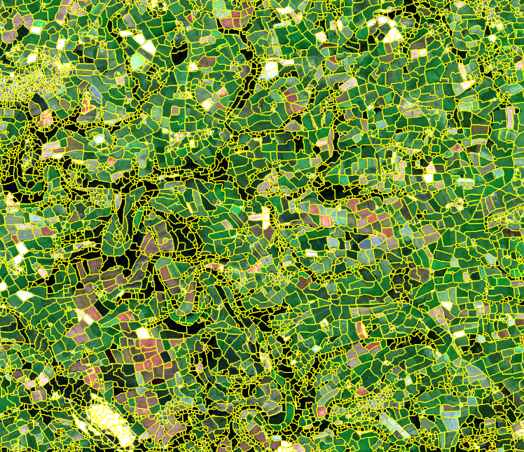

# Rasterio Segmentation plugin

`rasterio` plugin using `scikit-image` to segment a raster or set of **overlapping** rasters.
Also allows segmentation to be informed by existing shapefiles (e.g.  ordnance survey data).

### Pre-segmentation


### Segmented:


## Dependencies:

* rasterio
* fiona
* scikit-image >= pre-0.13

## Installation with conda on Windows:

Get miniconda for windows [here](https://repo.continuum.io/miniconda/Miniconda3-latest-Windows-x86_64.exe)

```
# get development scikit-image binaries (built from github master branch on 07-02-2017) 
conda create -n living_maps --channel mparker2 --channel conda-forge scikit-image=pre0.13 rasterio fiona

# activate the conda environment - nb activate script does not work in powershell for some reason?!
activate living_maps

git clone https://github.com/mparker2/rio-segment.git # in git-shell, or download zip
cd rio-segment
python setup.py install
```

# Usage

```
Usage: rio segment [OPTIONS] INPUTS... OUTPUT

  Segment an raster or set of rasters using watershed and RAG boundary
  merging. Input is a set of one or more rasters. Shapefiles can also be
  specified in the inputs and are used to inform the segmentation. Output is
  in the form of a single shapefile of segments.

Options:
  --no-data INTEGER               Overrides nodata value for raster files
  --shapefile-weight INTEGER      Weighting to give edges from shapefile
                                  compared to edgesdetected from rasters. A
                                  value between 0 and 255
  --size-pen INTEGER              Factor to penalise segments by size on
                                  merging. Set to ero to turn off this
                                  behaviour. Default: 10
  --rescale-perc <INTEGER INTEGER>...
                                  Percentiles to rescale each gtiff band to.
                                  default: 0 98
  --footprint INTEGER             Size of footprint for determining seeds for
                                  watershed segmentation. Default: 3
  --threshold INTEGER             Percentile threshold to merge segments at.
                                  Default: 50
  -h, --help, --usage             Show this message and exit.

```
